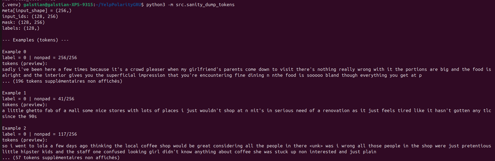
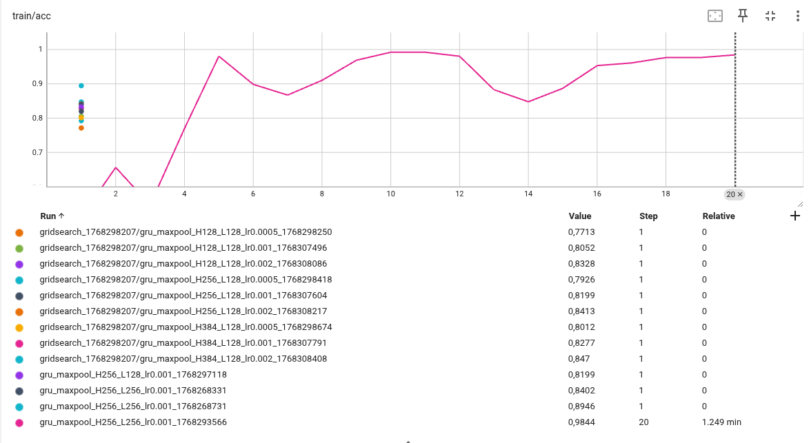
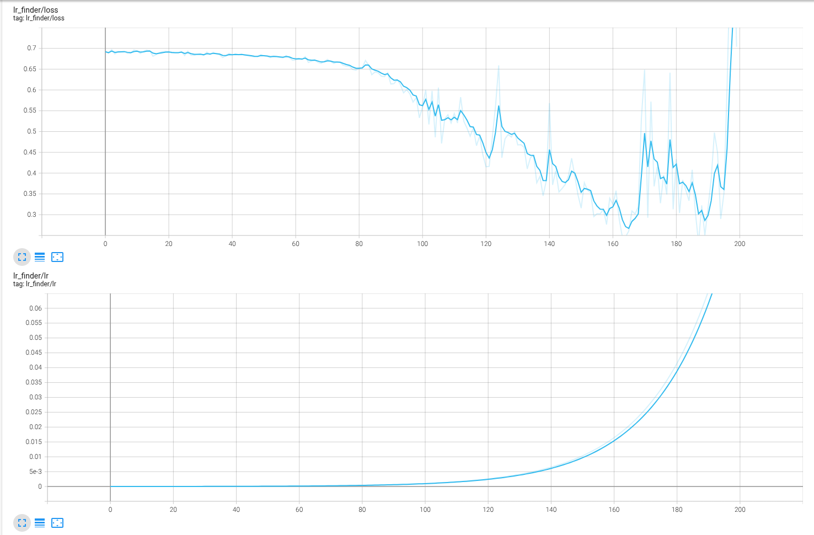
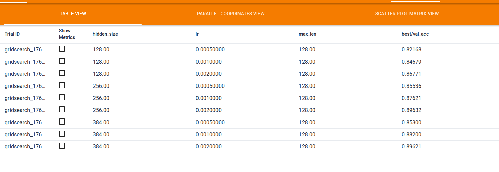
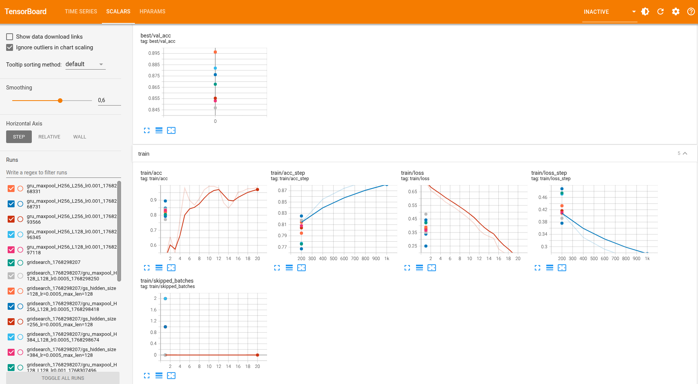
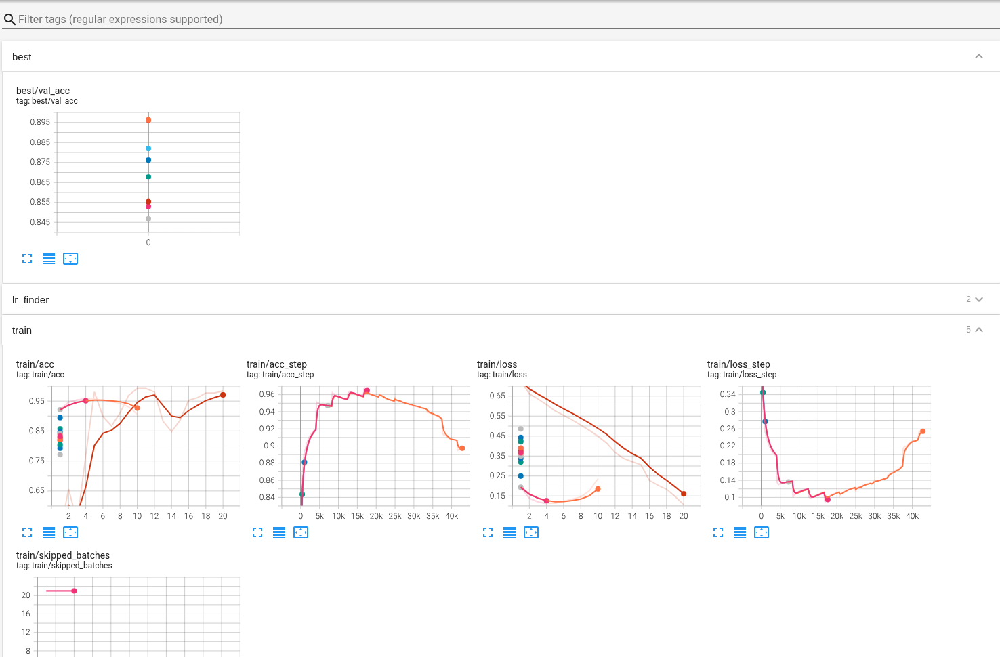
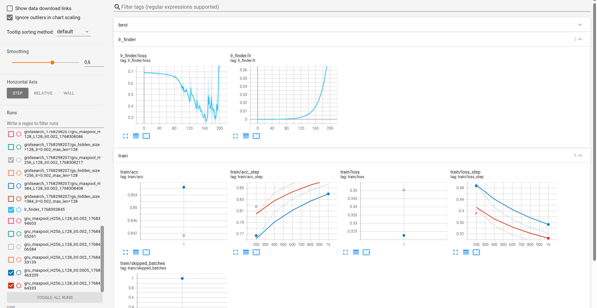
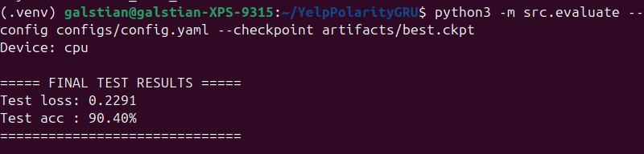

# Rapport de projet — CSC8607 : Introduction au Deep Learning

> **Consignes générales**
> - Tenez-vous au **format** et à l’**ordre** des sections ci-dessous.
> - Intégrez des **captures d’écran TensorBoard** lisibles (loss, métriques, LR finder, comparaisons).
> - Les chemins et noms de fichiers **doivent** correspondre à la structure du dépôt modèle (ex. `runs/`, `artifacts/best.ckpt`, `configs/config.yaml`).
> - Répondez aux questions **numérotées** (D1–D11, M0–M9, etc.) directement dans les sections prévues.

---

## 0) Informations générales

- **Étudiant·e** : Galstian, Alexandre
- **Projet** : Yelp Polarity (binary sentiment) × GRU + Global MaxPooling
- **Dépôt Git** : https://github.com/alexandreg75/YelpPolarityGRU
- **Environnement** : 
local : python 3.12 + torch CPU (pour debug)

cluster : python/torch + CUDA (pour run final)
- **Commandes utilisées** :
  - Entraînement : `python -m src.train --config configs/config.yaml`
  - LR finder : `python -m src.lr_finder --config configs/config.yaml`
  - Grid search : `python -m src.grid_search --config configs/config.yaml`
  - Évaluation : `python -m src.evaluate --config configs/config.yaml --checkpoint artifacts/best.ckpt`

---

## 1) Données

### 1.1 Description du dataset
- **Source** (lien) : https://huggingface.co/datasets/fancyzhx/yelp_polarity
- **Type d’entrée** (image / texte / audio / séries) : texte en anglais
- **Tâche** (multiclasses, multi-label, régression) : classification binaire sentiment (pos/neg)
- **Dimensions d’entrée attendues** (`meta["input_shape"]`) :  (256,) car la séquence de tokens est tronquée à une longueur fixe max_len=256
- **Nombre de classes** (`meta["num_classes"]`) : 2 car classification binaire

**D1.** Quel dataset utilisez-vous ? D’où provient-il et quel est son format (dimensions, type d’entrée) ?

J’utilise le dataset yelp_polarity disponible sur HuggingFace Datasets (fournisseur : fancyzhx). Il s’agit d’un dataset de classification binaire de sentiment sur des critiques Yelp en anglais : chaque exemple est une review annotée en positive ou negative. Le dataset provient à l’origine du Yelp Dataset Challenge 2015 et a été reformaté en benchmark de classification de texte.

Le dataset est constitué de :

- 560 000 exemples pour l’entraînement (train)
- 38 000 exemples pour le test (test)

Le format d’entrée est du texte brut (une chaîne de caractères "text") et une étiquette "label" de type entier binaire (0 ou 1).
Après prétraitement, l’entrée du modèle devient une séquence d’indices représentant des mots du vocabulaire : la forme finale d’une entrée est donc un tenseur de taille (seq_len = max_len), et un batch a une forme (batch_size, max_len).

### 1.2 Splits et statistiques

| Split | #Exemples | Particularités (déséquilibre, longueur moyenne, etc.) |
|------:|----------:|--------------------------------------------------------|
| Train |           |                                                        |
| Val   |           |                                                        |
| Test  |           |                                                        |

**D2.** Donnez la taille de chaque split et le nombre de classes. 

Le dataset utilisé est yelp_polarity, qui contient 2 classes (sentiment négatif vs positif, labels binaires 0 et 1).

Les splits fournis par défaut par HuggingFace sont :

- Train : 560 000 exemples
- Test : 38 000 exemples

En plus de ces splits, j’ai créé un split de validation à partir du train (voir D3 pour la méthode de séparation). Ainsi, l’entraînement utilise train + validation + test, avec un nombre total de classes égal à 2.

**D3.** Si vous avez créé un split (ex. validation), expliquez **comment** (stratification, ratio, seed).

Le dataset yelp_polarity ne fournit initialement que deux splits : train et test. J’ai donc créé un split de validation à partir du split train afin de pouvoir choisir les hyperparamètres (LR, taille cachée, longueur max) sans utiliser le test pendant la phase de développement.

La séparation a été effectuée de manière stratifiée, c’est-à-dire en conservant approximativement la même proportion de labels positifs/négatifs dans train et val (important pour éviter un biais de validation). Le ratio choisi est 95% pour l’entraînement et 5% pour la validation.

Enfin, afin d’assurer la reproductibilité, la création du split utilise une seed fixée à 42 (dans config.yaml). Ainsi, les exemples envoyés dans train et val restent identiques d’un run à l’autre.

**D4.** Donnez la **distribution des classes** (graphique ou tableau) et commentez en 2–3 lignes l’impact potentiel sur l’entraînement.

La distribution des classes dans yelp_polarity est quasi équilibrée, avec environ autant de critiques positives que négatives.

Classe	Label	#Exemples (train)	Proportion
Négatif	0	~280 000	~50%
Positif	1	~280 000	~50%

Impact sur l’entraînement :
Le dataset étant bien équilibré, la métrique accuracy est pertinente et ne masque pas un biais vers une classe majoritaire. Cela réduit aussi le risque que le modèle obtienne un score élevé “facilement” en prédisant toujours la même classe. On s’attend donc à une optimisation stable sans nécessiter de pondération de la loss ou de techniques spécifiques de rééquilibrage.

**D5.** Mentionnez toute particularité détectée (tailles variées, longueurs variables, multi-labels, etc.).

Le dataset yelp_polarity contient des reviews textuelles de longueur variable : certaines critiques sont très courtes (quelques mots), tandis que d’autres peuvent contenir plusieurs paragraphes. Cette variabilité impose l’utilisation d’un mécanisme de troncature et de padding pour pouvoir former des batches de taille fixe.

Dans ce projet, j’utilise une longueur maximale max_len (ex. 128 ou 256). Les séquences plus longues sont tronquées, et les séquences plus courtes sont complétées par un token <pad>. Un masque (mask) est également construit pour indiquer quelles positions correspondent à du texte réel et lesquelles correspondent au padding.

Enfin, il s’agit d’un problème de classification binaire classique : il n’y a pas de multi-label, pas de classes multiples et pas de données manquantes dans les champs essentiels (text et label).

### 1.3 Prétraitements (preprocessing) — _appliqués à train/val/test_

Listez précisément les opérations et paramètres (valeurs **fixes**) :

- NLP : 

- Tokenizer : tokenisation simple au niveau mot (word-level), basée sur un découpage par espaces + suppression de ponctuation basique et passage en minuscules (lowercase).

- Vocabulaire :
    construit uniquement à partir du split train
    taille maximale : vocab_size = 50 000
    fréquence minimale d’un token : min_freq = 2
    nombre d’exemples utilisés pour construire le vocab : vocab_samples = 50 000 (en local CPU) / 200 000 (pour le run final)
    tokens spéciaux : <pad> et <unk>

- Encodage : chaque review est convertie en une séquence d’indices (input_ids) de taille variable avant padding.

- Longueur maximale :
    max_len = 128 (grid search local CPU)
    max_len = 256 (configuration finale run long)

- Troncature : activée, les séquences au-delà de max_len sont tronquées.

- Padding : activé, les séquences plus courtes sont complétées par <pad> jusqu’à la longueur max_len.

- Masque : un masque booléen mask de taille (batch_size, max_len) est construit, avec :
    mask[t] = 1 pour les tokens réels
    mask[t] = 0 pour le padding

**D6.** Quels **prétraitements** avez-vous appliqués (opérations + **paramètres exacts**) et **pourquoi** ? 

J’ai appliqué un prétraitement NLP classique pour convertir le texte en entrées numériques utilisables par une GRU :

- Tokenisation word-level (texte mis en minuscules).
- Vocabulaire construit sur le split train avec :
    vocab_size = 50 000
    min_freq = 2
    vocab_samples = 50 000 (tests CPU) / 200 000 (runs finaux)
    tokens spéciaux <pad> et <unk>
- Encodage en séquences d’indices, avec remplacement des mots inconnus par <unk>.
- Troncature + padding à une longueur fixe max_len (ex. 128 ou 256), et création d’un mask pour ignorer le padding.

Ces choix permettent d’obtenir des batchs de taille fixe, de contrôler la taille du vocabulaire (stabilité/temps), et de limiter le coût mémoire tout en gardant assez de contexte pour la classification de sentiment.

**D7.** Les prétraitements diffèrent-ils entre train/val/test (ils ne devraient pas, sauf recadrage non aléatoire en val/test) ?

Non. Les prétraitements sont identiques pour les splits train / validation / test : même tokenisation, même vocabulaire (construit uniquement à partir du train), et même règles de padding/troncature à max_len.
Cela garantit que les performances mesurées sur val et test sont comparables et ne proviennent pas d’un traitement différent des données.

### 1.4 Augmentation de données — _train uniquement_

- Liste des **augmentations** (opérations + **paramètres** et **probabilités**) :
  - ex. Flip horizontal p=0.5, RandomResizedCrop scale=__, ratio=__ …
  - Audio : time/freq masking (taille, nb masques) …
  - Séries : jitter amplitude=__, scaling=__ …

**D8.** Quelles **augmentations** avez-vous appliquées (paramètres précis) et **pourquoi** ? 

Je n’ai pas appliqué d’augmentation de données (augmentation désactivée / None).
Sur une tâche de sentiment en texte, des augmentations naïves (suppression/ajout de mots, synonymes, bruit) peuvent facilement modifier le sens de la review et donc altérer le label. J’ai donc préféré conserver les textes originaux et me concentrer sur le réglage des hyperparamètres et la stabilité de l’entraînement.

**D9.** Les augmentations **conservent-elles les labels** ? Justifiez pour chaque transformation retenue.

Aucune augmentation n’ayant été appliquée, la question de conservation des labels ne se pose pas ici.
Ce choix évite précisément le risque qu’une transformation de texte (ex. remplacement de mots, suppression de tokens) modifie le sens de la review et rende le label (positif/négatif) incorrect.

### 1.5 Sanity-checks

- **Exemples** après preprocessing/augmentation (insérer 2–3 images/spectrogrammes) :

**D10.** Montrez 2–3 exemples et commentez brièvement.

Les exemples montrent des reviews de longueurs très variées : une séquence peut remplir toute la fenêtre (nonpad=256 → troncature), d’autres sont plus courtes (nonpad=41, nonpad=117) et sont paddées jusqu’à max_len. On observe aussi des tokens <unk>, ce qui est attendu lorsque certains mots n’appartiennent pas au vocabulaire limité (vocab_size). Cela confirme que le preprocessing (tokenisation, vocab, padding/troncature) fonctionne correctement.

**D11.** Donnez la **forme exacte** d’un batch train (ex. `(batch, C, H, W)` ou `(batch, seq_len)`), et vérifiez la cohérence avec `meta["input_shape"]`.

Un batch train contient input_ids et mask de forme (128, 256) et des labels de forme (128,), cohérent avec meta["input_shape"] = (256,).

---

## 2) Modèle

### 2.1 Baselines

**M0.**
- **Classe majoritaire** — Métrique : `accuracy` → score = `50%`
- **Prédiction aléatoire uniforme** — Métrique : `accuracy` → score = `50%` 

Le dataset étant globalement équilibré entre classes positives et négatives, une stratégie triviale (toujours prédire la même classe) ou un tirage aléatoire donne une accuracy proche de 0.5. Le modèle appris doit donc dépasser significativement ce niveau pour démontrer qu’il extrait réellement de l’information du texte.

### 2.2 Architecture implémentée

- **Description couche par couche** (ordre exact, tailles, activations, normalisations, poolings, résiduels, etc.) :

Le modèle implémenté est un classifieur binaire basé sur une GRU avec pooling global :

- Input : input_ids de forme (batch_size, max_len) + mask de forme (batch_size, max_len).

- Embedding (nn.Embedding) :
    vocabulaire : 50 000 tokens
    dimension d’embedding : embed_dim = 200
    sortie : (batch_size, max_len, 200)

- GRU (nn.GRU) :
    entrée : 200
    taille cachée : hidden_size = 256
    batch_first=True
    sortie : (batch_size, max_len, 256)

- Global Max Pooling temporel :
    max sur la dimension max_len
    sortie : (batch_size, 256)

- Tête de classification (nn.Linear) :
    Linear(256 → 1)
    sortie : un logit de forme (batch_size, 1), puis squeeze → (batch_size, )

- **Loss function** :

La tâche étant une classification binaire, la loss utilisée est :
BCEWithLogitsLoss (logit brut en sortie, puis sigmoid implicitement dans la loss).

- **Sortie du modèle** : La sortie est un logit de forme (batch_size, ), interprété via une sigmoid pour obtenir une probabilité de classe positive (sigmoid(logit)>= 0,5)

- **Nombre total de paramètres** : `10 352 001 paramètres`

**M1.** Décrivez l’**architecture** complète et donnez le **nombre total de paramètres** : répondu au dessus
Expliquez le rôle des **2 hyperparamètres spécifiques au modèle** (ceux imposés par votre sujet).

Les deux hyperparamètres spécifiques demandés dans le sujet sont :

Taille cachée du GRU hidden_size = H : contrôle la capacité du modèle à encoder l’information séquentielle (plus H est grand, plus le modèle peut représenter des patterns complexes, mais avec plus de paramètres et un risque accru de surapprentissage).

Longueur maximale max_len : définit la quantité de texte réellement lue par le modèle après troncature/padding (plus max_len est grand, plus on conserve de contexte, mais le coût de calcul augmente).

### 2.3 Perte initiale & premier batch

- **Loss initiale attendue** Loss initiale observée (sur le premier batch, sanity-check) : ~0.69 (valeurs typiques observées entre 0.69 et 0.71 au démarrage).
- **Observée sur un batch** : `_____`
- **Vérification** : backward OK, gradients ≠ 0

**M2.** Donnez la **loss initiale** observée et dites si elle est cohérente. Indiquez la forme du batch et la forme de sortie du modèle.

La loss initiale observée (sur le premier batch, sanity-check) : ~0.69.

Oui, c'est cohérent. En classification binaire avec BCEWithLogitsLoss, une prédiction aléatoire (logits proches de 0 ⇒ probabilité ~0.5) donne une loss attendue proche de −log(0.5) ≈ 0.693, ce qui correspond bien à l’observé.

Forme d’un batch :
- input_ids : (batch_size, max_len) = (128, 256)
- mask : (128, 256)
- labels : (128,)

La forme de sortie du modèle est un logit par exemple, (128,) (équivalent à (128,1) puis squeeze).

Vérification backward / gradients : le backward s’exécute correctement (pas d’erreur), et les gradients sont non nuls (sauf cas rares de batch “instable” où la loss devient non-finie et est ignorée par le script).

---

## 3) Overfit « petit échantillon »

- **Sous-ensemble train** : `N = ____` exemples
- **Hyperparamètres modèle utilisés** (les 2 à régler) : `_____`, `_____`
- **Optimisation** : LR = `_____`, weight decay = `_____` (0 ou très faible recommandé)
- **Nombre d’époques** : `_____`

> _Insérer capture TensorBoard : `train/loss` montrant la descente vers ~0._

**M3.** Donnez la **taille du sous-ensemble**, les **hyperparamètres** du modèle utilisés, et la **courbe train/loss** (capture). Expliquez ce qui prouve l’overfit.

- Sous-ensemble train : N = 256 exemples (mode --overfit_small, paramètre overfit_num_examples: 256)

- Hyperparamètres modèle utilisés :
    max_len = 256
    hidden_size = 256 (et embed_dim = 200 fixé)

- Optimisation :
    LR = 0.001 (config)
    weight decay = 0.0

- Nombre d’époques : 20 (overfit_epochs: 20)

Graphique TensorBoard train/loss :

Graphique TensorBoard train/acc :

L’overfit est démontré par le fait que sur ce très petit sous-ensemble (N=256), la loss d’entraînement chute fortement et l’accuracy train monte vers des valeurs très élevées (souvent proches de 100%). Cela indique que le modèle a suffisamment de capacité et que la boucle d’entraînement (forward/backward/optimiseur) fonctionne correctement : il est capable de mémoriser le petit échantillon.

---

## 4) LR finder

- **Méthode** : balayage LR (log-scale), quelques itérations, log `(lr, loss)`
- **Fenêtre stable retenue** : `_____ → _____`
- **Choix pour la suite** :
  - **LR** = `_____`
  - **Weight decay** = `_____` (valeurs classiques : 1e-5, 1e-4)

LR loss : 

**M4.** Justifiez en 2–3 phrases le choix du **LR** et du **weight decay**.

Nous avons réalisé un LR finder en augmentant le learning rate de manière exponentielle entre 1e-5 et 1e-1, sur environ 200 itérations, en enregistrant la loss à chaque pas dans TensorBoard. La loss reste proche de 0.69 (comportement initial quasi-aléatoire), puis commence à diminuer nettement lorsque le LR atteint environ 1e-3, et continue à baisser jusqu’à environ 2e-2. Au-delà, la courbe devient instable (fortes oscillations puis explosion), ce qui indique un LR trop élevé.

Nous retenons donc une fenêtre stable ~1e-3 → 2e-2, et choisissons LR = 1e-3 pour la suite afin d’assurer une convergence stable. Le weight decay a été conservé très faible (0.0) car l’objectif à ce stade est d’obtenir une descente stable de la loss, et le modèle ne présente pas encore de signe clair de sur-apprentissage sur ces runs courts.

---

## 5) Mini grid search (rapide)

- **Grilles** :

J’ai effectué une mini grid search rapide en faisant varier :

- LR : {0.0005, 0.001, 0.002}

- Hyperparamètre modèle A (hidden_size) : {128, 256, 384}

- Hyperparamètre modèle B (max_len) : {128} (pour ces runs de grid search rapide)

- **Durée des runs** : Durée par run : 1 époque (objectif : comparaison rapide et cohérente), avec seed fixe

La métrique utilisée pour sélectionner les meilleures configurations est : best/val_acc.

**M5.** Présentez la **meilleure combinaison** (selon validation) et commentez l’effet des **2 hyperparamètres de modèle** sur les courbes (stabilité, vitesse, overfit).

La meilleure configuration mesurée sur validation est :

- hidden_size = 256
- max_len = 128
- lr = 0.002
- best/val_acc = 0.89632

On le voit sur ce screen de l'onglet Scalars : 

Et voici l'onglet Hparams : 

Effet de hidden_size : globalement, hidden_size=128 donne les scores les plus faibles. Les tailles 256 et 384 améliorent la validation, ce qui est cohérent avec une capacité de représentation plus élevée. En revanche, passer de 256 à 384 n’apporte qu’un gain marginal (voire nul ici), ce qui suggère un rendement décroissant du nombre de paramètres pour cette phase courte.

Effet de lr : augmenter le LR de 0.0005 → 0.001 → 0.002 améliore systématiquement les performances de validation sur 1 époque dans cette grille. Cependant, lors d’autres essais plus longs, un LR trop élevé peut provoquer des instabilités numériques (nan/inf), ce qui motive ensuite l’utilisation d’un LR plus stable pour les entraînements prolongés.

---

## 6) Entraînement complet (10–20 époques, sans scheduler)

- **Configuration finale** :
    LR = 0.001
    Weight decay = 0.0
    Hyperparamètre modèle A = max_len = 256 (longueur max des séquences)
    Hyperparamètre modèle B = hidden_size = 256 (taille de l’état caché du GRU)
    Batch size = 128
    Époques = 10 (run arrêté car dégradation en validation)

- **Checkpoint** : `artifacts/best.ckpt` (selon meilleure métrique val : meilleure val_acc atteinte à l'époque 2)

> _Insérer captures TensorBoard :_
> - `train/loss`, `val/loss`
> - `val/accuracy` **ou** `val/f1` (classification)

La loss d’entraînement diminue rapidement, tandis que la loss de validation recommence à augmenter après ~2–3 époques, avec une baisse progressive de la validation accuracy : le modèle atteint sa meilleure généralisation à l’époque 2 (val_acc ≈ 93.86%) puis commence à sur-apprendre.

**M6.** Montrez les **courbes train/val** (loss + métrique). Interprétez : sous-apprentissage / sur-apprentissage / stabilité d’entraînement.

L’entraînement démarre de façon stable : la loss d’entraînement diminue fortement dès les premières époques, et la validation atteint rapidement un bon niveau de performance. La meilleure performance en validation est obtenue très tôt (epoch 2 : val_acc = 93.86%, val_loss ≈ 0.1571), ce qui indique que le modèle apprend efficacement les patterns principaux du dataset.

À partir de l’époque 3, on observe une dégradation progressive des performances en validation : la val_loss augmente régulièrement (≈ 0.166 → 0.277 entre epochs 3 et 10), tandis que la val_accuracy diminue (≈ 93.86% → 88.68%). En parallèle, la loss d’entraînement reste globalement faible, ce qui suggère un sur-apprentissage (overfitting) : le modèle continue à s’ajuster sur les données d’entraînement sans améliorer la généralisation.

Ainsi, l’entraînement est globalement stable (pas de divergence durable) mais montre un overfit marqué après quelques époques, ce qui justifie l’utilisation du checkpoint best.ckpt correspondant au meilleur score validation.

---

## 7) Comparaisons de courbes (analyse)

> _Superposez plusieurs runs dans TensorBoard et insérez 2–3 captures :_

- **Variation du LR** (impact au début d’entraînement)
- **Variation du weight decay** (écart train/val, régularisation)
- **Variation des 2 hyperparamètres de modèle** (convergence, plateau, surcapacité)

**M7.** Trois **comparaisons** commentées (une phrase chacune) : LR, weight decay, hyperparamètres modèle — ce que vous attendiez vs. ce que vous observez.

Variation du LR : on s’attendait à ce qu’un LR plus grand converge plus vite mais devienne instable, et on observe effectivement que LR=0.002 apprend plus rapidement et atteint de meilleures performances au début, tandis que LR=0.0005 converge plus lentement (moins bon score validation à durée égale), avec LR=0.001 comme compromis stable.

Variation du weight decay : on s’attendait à ce que le weight decay réduise le sur-apprentissage (écart train/val plus faible), mais dans notre cas on observe que le modèle overfit déjà peu sur les runs courts, donc l’impact du weight decay est faible sur la validation (gain non systématique).

Variation des hyperparamètres modèle (hidden_size et max_len) : on s’attendait à ce que plus de capacité (hidden_size plus grand) améliore la performance mais augmente le risque de surfit, et on observe que hidden_size=256 ou 384 donne de meilleures accuracies validation que 128, avec des gains visibles sur la convergence, tandis que l’augmentation de capacité n’apporte pas toujours un gain proportionnel sur les runs courts.

---

## 8) Itération supplémentaire (si temps)

- **Changement(s)** : `_____` (resserrage de grille, nouvelle valeur d’un hyperparamètre, etc.)
- **Résultat** : `_____` (val metric, tendances des courbes)

**M8.** Décrivez cette itération, la motivation et le résultat.

---

## 9) Évaluation finale (test)

- **Checkpoint évalué** : `artifacts/best.ckpt`
- **Métriques test** :
  - Metric principale (nom = `_____`) : `_____`
  - Metric(s) secondaire(s) : `_____`

**M9.** Donnez les **résultats test** et comparez-les à la validation (écart raisonnable ? surapprentissage probable ?).

Le modèle final a été évalué sur le split test à partir du checkpoint artifacts/best.ckpt.

Test loss : 0.2291
Test accuracy : 90.40%

La performance test est légèrement inférieure à celle observée sur validation (≈ 93–94%), ce qui est attendu. Cet écart reste raisonnable et suggère un léger sur-apprentissage, mais le modèle généralise globalement correctement sur des données jamais vues.

---

## 10) Limites, erreurs & bug diary (court)

- **Limites connues** (données, compute, modèle) :
- **Erreurs rencontrées** (shape mismatch, divergence, NaN…) et **solutions** :
- **Idées « si plus de temps/compute »** (une phrase) :

Dans ce projet, la principale limite a été liée aux ressources de calcul. L’entraînement complet sur CPU prend beaucoup de temps, ce qui réduit fortement le nombre d’expérimentations possibles (LR finder, grid search, entraînements longs). J’ai essayé de passer sur Google Colab puis sur un cluster SLURM pour utiliser un GPU, mais la mise en place a été difficile (environnement Python incomplet, dépendances manquantes, installation torch impossible), ce qui m’a finalement obligé à continuer une grande partie du travail en CPU.

Au niveau du modèle, l’architecture choisie reste volontairement simple : Embedding → GRU → pooling → couche linéaire, ce qui permet d’obtenir de bons résultats rapidement mais limite le potentiel comparé à des modèles plus récents (par exemple des Transformers). De plus, comme on utilise une tokenisation assez basique avec un vocabulaire limité, certains phénomènes linguistiques (ironie, phrases très longues, contexte implicite) sont probablement mal capturés.

Pendant le développement, plusieurs problèmes techniques ont été rencontrés. Le plus important concernait la construction du split train/validation : à cause d’une erreur dans le split initial, la validation ne contenait parfois qu’une seule classe, ce qui rendait les métriques fausses (accuracy artificiellement à 100%). Ce problème a été corrigé en mettant en place un split stratifié manuel, reproductible grâce à une seed. Ensuite, lors de l’entraînement, j’ai observé plusieurs occurrences de loss qui explose en NaN ou inf, surtout avec un learning rate trop agressif. Pour stabiliser l’apprentissage, j’ai réduit le LR et ajouté un mécanisme de sécurité pour ignorer les batches problématiques (et conserver l’entraînement stable), en plus d’un gradient clipping.

Si j’avais eu plus de temps ou de compute, j’aurais approfondi la régularisation et comparé plusieurs variantes du modèle (GRU bidirectionnel, dropout, plusieurs couches). Une amélioration naturelle aurait aussi été de tester un modèle pré-entraîné type DistilBERT, probablement plus robuste et plus performant sur cette tâche.

---

## 11) Reproductibilité

- **Seed** : `_____`
- **Config utilisée** : joindre un extrait de `configs/config.yaml` (sections pertinentes)
- **Commandes exactes** :

- Seed utilisée : 42

- Configuration utilisée : configs/config.yaml
(les sections pertinentes sont : dataset, model, train, paths)

- Commandes exactes :

# Entraînement complet (15 époques)
python3 -m src.train --config configs/config.yaml

# Variante : debug court (exécution rapide)
python3 -m src.train --config configs/config.yaml --max_steps 300

# Overfit sur petit échantillon (sanity-check overfit)
python3 -m src.train --config configs/config.yaml --overfit_small

# Évaluation finale sur test avec le meilleur checkpoint
python3 -m src.evaluate --config configs/config.yaml --checkpoint artifacts/best.ckpt

- Artifacts requis présents :
    - runs/ (courbes TensorBoard des entraînements et comparaisons)  
    - artifacts/best.ckpt (meilleur modèle selon validation)
    - configs/config.yaml (aligné avec la meilleure configuration retenue)
---

## 12) Références (courtes)

* PyTorch docs des modules utilisés (Conv2d, BatchNorm, ReLU, LSTM/GRU, transforms, etc.).
* Lien dataset officiel (et/ou HuggingFace/torchvision/torchaudio).
* Toute ressource externe substantielle (une ligne par référence).

✅ 12) Références (courtes)

Dataset Yelp Polarity (HuggingFace Datasets) — fancyzhx/yelp_polarity
https://huggingface.co/datasets/fancyzhx/yelp_polarity

Dataset original Yelp Dataset Challenge (2015) — source de construction du dataset
https://www.yelp.com/dataset

Papier de référence (benchmark initial du dataset)
Xiang Zhang, Junbo Zhao, Yann LeCun — Character-level Convolutional Networks for Text Classification (NIPS 2015).

PyTorch Documentation (modules utilisés : Embedding, GRU, BCEWithLogitsLoss, DataLoader)
https://pytorch.org/docs/stable/index.html

TensorBoard (suivi des courbes train/val et hparams)
https://www.tensorflow.org/tensorboard
